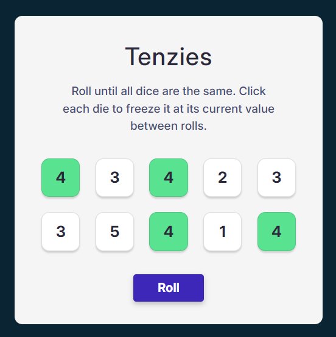

# 🎲 Tenzies Game 🎲

A simple but fun dice game built with React and Vite. The goal is to roll the dice until all of them are the same. Click a die to freeze it at its current value between rolls.


### [➡️ View Live Demo ⬅️](https://www.google.com/url?sa=E&q=https%3A%2F%2Ftariq-k-dev.github.io%2Ftenzies%2F)



## How to Play
1. Click the "Roll" button to roll the dice.
2. If you get a die value you want to keep, click on that die to "freeze" it.
3. Continue rolling until all 10 dice show the same number.
4. Once you win, you can start a new game!

## Features
- **Interactive Dice Grid**: A 10-die grid that updates with each roll.
- **Freeze Dice**: Click on any die to hold its value for the next roll.
- **Win Detection**: The game automatically detects when you've won.
- **New Game**: Easily reset the board to play again.
- **Roll Counter** (Optional Feature): Tracks how many rolls it takes to win.

## Technologies Used
- **Frontend**: [React](https://www.google.com/url?sa=E&q=https%3A%2F%2Freactjs.org%2F)
- **Build Tool**: [Vite](https://www.google.com/url?sa=E&q=https%3A%2F%2Fvitejs.dev%2F)
- **Package Manager**: [pnpm](https://www.google.com/url?sa=E&q=https%3A%2F%2Fpnpm.io%2F)
- **Deployment**: [GitHub Actions](https://www.google.com/url?sa=E&q=https%3A%2F%2Fgithub.com%2Ffeatures%2Factions) & [GitHub Pages](https://www.google.com/url?sa=E&q=https%3A%2F%2Fpages.github.com%2F)
- **Linting**: [ESLint](https://www.google.com/url?sa=E&q=https%3A%2F%2Feslint.org%2F)

## Getting Started Locally
To run this project on your own machine, follow these steps.

### Prerequisites

Make sure you have [Node.js](https://www.google.com/url?sa=E&q=https%3A%2F%2Fnodejs.org%2F) installed, as well as the [pnpm](https://www.google.com/url?sa=E&q=https%3A%2F%2Fpnpm.io%2Finstallation) package manager.

```bash
# Install pnpm globally if you don't have it
npm install -g pnpm
```

### Installation & Setup

1. **Clone the repository:**

   Generated bash

   ```bash
   git clone https://github.com/tariq-k-dev/tenzies.git
   ```

2. **Navigate to the project directory:**

   ```bash
   cd tenzies
   ```

3. **Install the dependencies:**

   ```bash
   pnpm install
   ```

4. **Start the development server:**

   ```bash
   pnpm run dev
   ```

   Your project will be running at http://localhost:5173.

## Available Scripts

In the project directory, you can run:

- pnpm dev: Runs the app in development mode.
- pnpm build: Builds the app for production to the dist folder.
- pnpm lint: Lints the code using ESLint to find and fix problems.
- pnpm preview: Serves the production build locally to preview it before deployment.

## Deployment

This project is configured for continuous deployment using GitHub Actions. Any push to the main branch will automatically trigger a workflow that builds the project and deploys the static files to GitHub Pages.

## License

This project is licensed under the MIT License. See the [LICENSE](LICENSE) file for details.

